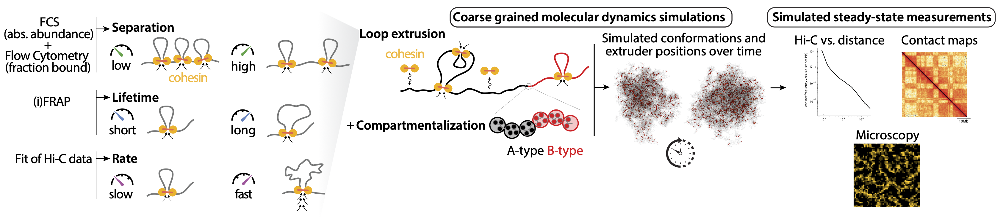

# Simulating the role of extrusion rate on higher-order chromatin folding 

**Illustration**: The model is parametrized using *in vivo* measurements of cohesin abundance and kinetics in mESCs. It combines lattice-based Monte-Carlo simulations of extrusion kinetics with large-scale molecular dynamics simulations to quantitatively map the effects of single-cohesin properties on larger-scale organization processes, such as compartment formation and chromosome-wide 'vermicelli' compaction. 
<!--
- **Left**: Lattice model showing a simulated genomic region (grey) with a long-lived barrier acting as an anchor (left site, red) and multiple downstream dynamic barrier positions (right three sites, red). The two genomic positions held together by the extruder is depicted with a light arch. If a barrier becomes unbound, an extruder blocked at this site can continue extruding. Note that CTCF can re-bind when the barrier is inside of an extruded loop.
- **Right**: The consequence on 3D genome organization.-->

### Description
This GitHub repository contains a minimal tutorial showcasing simulations of chromatin loop extrusion with tunable rate, lifetime and loaded density, along with their interplay with experimentally-calibrated polymer kinetics and affinity-based compartment formation.

Preprint available here: <https://doi.org/10.1101/2025.08.14.667581>

  
### Requirements
- *polychrom-hoomd*: A toolkit for polymer simulations. (https://github.com/open2c/polychrom-hoomd)
- *HooMD-blue*: A library for GPU-accelerated molecular simulations. (https://hoomd-blue.readthedocs.io/en/v6.1.1/)
- *polykit*: A suite of utilities for polymer simulation design and analysis (https://github.com/open2c/polykit)

### Workflow
  
See the `tutorial_velocity.ipynb` Jupyter notebook.  
